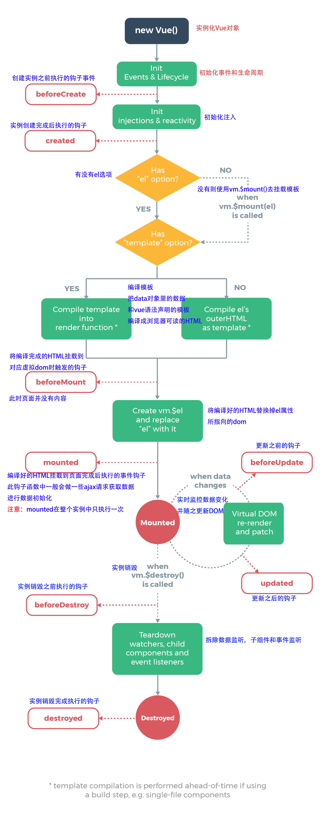

# 前提
## 安装Js
 方法1：下载vue.js文件，保存在js目录下
  方法2：采用npm方式 $ npm install vue  后期采用

## Vue基本结构
```

<body>
    <div id="app">
    {{message}}
    </div>
</body>
<script src="../js/vue.js"></script>
<script>
    const app = new Vue({
        el:'#app',
        data:{
            message:'',
        }
    })
</script>
```
执行流程：使用vue中的el指明要管理的元素是app，然后去检测app 发现有一个message参数
 会去数据data中去查看是否有这个参数 有会填坑一样将数据填在参数中

##生命周期
 当我们写下简单的new Vue() 这是开始在Vue.js中开始出生，走路，吃饭等
  在vue实例里面或者组件里面定义一些函数，会在某个时候回调这些函数。
  

```
created : 在绑定元素的属性或事件监听器被应用之前调用。

beforeMount : 指令第一次绑定到元素并且在挂载父组件之前调用。。

mounted : 在绑定元素的父组件被挂载后调用。。

beforeUpdate: 在更新包含组件的 VNode 之前调用。。

updated: 在包含组件的 VNode 及其子组件的 VNode 更新后调用。

beforeUnmount: 当指令与在绑定元素父组件卸载之前时，只调用一次。

unmounted: 当指令与元素解除绑定且父组件已卸载时，只调用一次。
```
## 插值语法
1.{{}}:叫Mustache语法 也叫胡须语法 双大括号语法

## 指令(自定义属性)
- v-once:
  当我们响应的时候不希望这个跟着响应一起变 所以使用该指令
  元素和组件(组件后面才会学习)只渲染一次，不会随着数据的改变而改变。
  `<h1 v-once>{{message}}</h1>`
- v-html:
  我们从服务器请求到的数据本身就是一个HTML代码
  如果我们直接通过{{}}来输出，会将HTML代码也一起输出。
  但是我们可能希望的是按照HTML格式进行解析，并且显示对应的内容。
  `<h2 v-html="url"></h2>`
  deta中的url为` url:'<a href="http://www.baidu.com">点我搜索</a>'`

- v-text:
用法还不如Mustache 不看也罢。就是直接将这个文本输出 v-text="message"
`<div v-text="msg"></div>`
- v-pre：
  如果要将{{message}}原封不动的输出，不渲染不传值 就使用 直接在元素中添加 v-pre
  `<div v-pre>{{msg}}</div>`直接输出mag而不会调用data中的参数msg
### 指令事件绑定
- v-on事件监听
  - v-on 指令可以缩写为 @ 符号。
  - 事件处理程序中可以有多个方法，这些方法由逗号运算符分隔`<button @click="one($event), two($event)">` 
  - Vue 允许为 v-on 在监听键盘事件时添加按键修饰符`<input @:keyup.13="submit">`只有在 keyCode 是 13 时调用 .submit())  
  `<input v-on:keyup.enter="submit">`
```
.enter
.tab
.delete (捕获 "删除" 和 "退格" 键)
.esc
.space
.up
.down
.left
.right

系统修饰键：
.ctrl
.alt
.shift
.meta

鼠标按钮修饰符:
.left
.right
.middle
```
```
<body>
    <div id="app">
        <span>{{conter}}</span>
        <!-- <button v-on:click="add">+</button> -->
        <button @click="add">+</button>
        <!-- 演示当不只要传普通的参数a,还要传默认的event的话 要写为$event的格式 而且在函数中
             也要写形参接收 -->
        <button @click="a(10,$event)">按钮二</button>
    </div>
</body>
<script src="../../js/vue.js"></script>
<script>
    const app = new Vue({
        el:'#app',
        data:{
            conter:0,
        },
        methods:{
            // 如果要使用默认参数e 在调用的时候 默认调用e 就是直接不写(e)
            add(e){
                this.conter++;
                console.log(e);
            },
            a(a,e){
                console.log(a);
                console.log(e);
            }
        }
    })
</script>
  ```
 v-on的修饰符
```
<body>
    <div id="app">
        <!-- 1.阻止冒泡 -->
       <div @click="divonclick">我是文本
         <!-- <button @click="btnonclick">阻止冒泡</button> -->
         <button @click.stop="btnonclick">阻止冒泡</button>
        </div>

        <!-- 2.阻止默认事件 -->
         <form action="#">
           <input type="submit" @click.prevent="subclick">
         </form>
       
        <!-- 3.只能点击一次 -->
        <button @click.once="btn2click">只能点一次</button>

        <!-- 4.监听某个键帽的点击 只监听回车-->
      <input type="text" @keyup.enter="keyUp" />
    </div>
    <!-- 如果是这样的话 div btn都会被触发 因为事件冒泡 使用.stop标识符来阻止冒泡 -->
</body>
<script src="../../js/vue.js"></script>
<script>
    const app = new Vue({
        el:'#app',
        methods:{
            divonclick(){
              console.log("我是div");
            },
            btnonclick (){
              console.log("我是btn");
            },
            subclick(){
              console.log("我被阻止了默认行为,自动提交 如果是自动提交,你就看不见我");
            },
            btn2click(){
              console.log("我点过一次就不能再点击了");
            },
            keyUp(){
              console.log("我是回车,我放开的时候被触发  ");
            }
        }
    })
</script>
```
- v-bind
  在实际开发中元素的某些属性值都不是固定的，所以我们要动态的生成 所以我们使用v-bind
  -  让v-bind来指示那个属性需要动态绑定 v-bind:src="imgurl"
  -  语法糖的写法 直接：src="imgurl"
  - v-bind 在处理 class 和 style 时， 表达式除了可以使用字符串之外，还可以是对象或数组。
  1.对象
```
<style>
.static {
	width: 100px;
	height: 100px;
}
.active {
	background: green;
}
.text-danger {
	background: red;
}
</style>
</head>
<body>
<div id="app">
    <div class="static" :class="{ 'active': isActive, 'text-danger': hasError }">
    </div>
</div>

<script>
const app = {
    data() {
      return {
         isActive: false,
         hasError: true
      }
   }
}
</script>

结果为:<div class="static text-danger"></div>
```
  2.数组
```
<style>
.static {
    width: 100px;
    height: 100px;
}
.active {
    background: green;
}
.text-danger {
    background: red;
}
</style>
</head>
<body>
<div id="app">
    <div class="static" :class="[activeClass, errorClass]"></div>
</div>
​
<script>
const app = {
    data() {
        return {
            activeClass: 'active',
            errorClass: 'text-danger'
        }
    }
}
结果为:<div class="static active text-danger"></div>
```
- v-model
  `在表单 <input>、<textarea> 及 <select> 等元素上创建双向数据绑定`
  - v-model 会忽略所有表单元素的 value、checked、selected 属性的初始值，使用的是 data 选项中声明初始值。

   - v-model 在内部为不同的输入元素使用不同的属性并抛出不同的事件：
    >>1.text 和 textarea 元素使用 value 属性和 input 事件；
    >>2.checkbox 和 radio 使用 checked 属性和 change 事件；
    >>3.select 字段将 value 作为属性并将 change 作为事件

就是在在使用v-model中使用不同的表单标签有不同的bababababa,建议看代码

# 组件开发
## 为啥要组件开发呢？
  因为便于管理 
  是树型结构


## 组件开发的步骤？
>1.创建组件构造对象 里面的是模板
```
 const myvue = Vue.extend({
      template:` 
      <div>
         <h2>我是组件</h2>
      </div>`
    })
```
>2.注册组件
 - 全局组件
   `Vue.component('my-cpn',myvue)`
 - 局部组件
   在vue实例下面
   ```
   components:{
          mycpn:myvue
        }
    ```
>3.使用组件 
  `<mycpn></mycpn>`

## 语法糖
  去掉Vue.extend()将参数直接传在注册组件参数中
  - 全局组件
  ```
  Vue.component('my-cpn',{
      template:` 
      <div>
         <h2>我是组件</h2>
      </div>`
    })
  ```
  - 局部组件
     在vue实例下面 将定义的const myvue部分直接写在component/components后面

   components:{
          mycpn:{
                  template:` 
                  <div>
                    <h2>我是组件</h2>
                  </div>`
                }
        }

***
这样直接在里面写模板太复杂 
## 分离模板
  --使用text/x-template
  <script type="text/x-template" id="cpn">
    <div>
      <h2>我是组件</h2>
    </div>
</script>

  --使用template标签
  <template id="cpn">
  <div>
    <h2>我是组件</h2>
  </div>
</template>
 这两种方法都使用id来连接 例如在全局组件中 是这样的
  Vue.component('my-cpn',{
      template:'#cpn'
    })

分离出模板后 觉得模板中的数据因该是动态可修改的
使用的是组件数据中的data  例如在全局组件中 是这样的
 Vue.component('my-cpn',{
      template:'#cpn',
      data(){
        return{
          message:'我是动态可变的'
        }
      }
    })

### 形态1
```
<body>
    <div id="app">
    //3.将组件写到合适位置上
      <mycpn></mycpn>
    </div>
    <div id="app2">
      <mycpn></mycpn>
    </div>
</body>
<script src="../../js/vue.js"></script>
<script>
    //1.创造模板
    const myvue = Vue.extend({
      template:` 
      <div>
         <h2>我是组件</h2>
      </div>`
    })
    //2.挂到组件mycpn上

    // 通过这种方式创造出来的是全局组件
    // Vue.component('mycpn',myvue)
 
    const app = new Vue({
        el:'#app',
        // 通过这种方式来创造局部组件
        components:{
          mycpn:myvue
        }
    })
    const app2 = new Vue({
        el:'#app2'
    })
</script>
  ```
  * * * 
### 形态2
```
<body>
    <div id="app">
      <my-cpn></my-cpn>
    </div> 
</body>

<!-- 分离方法1：使用text/x-template -->
<!-- <script type="text/x-template" id="cpn">
  <div>
    <h2>我是组件1</h2>
 </div>
</script> -->

<!-- 分离方法2：使用template标签 -->
<!-- 两种方式都使用id来跟注册组件里相互联系在一起 -->
<template id="cpn">
  <div>
    <h2>我使用的是template标签的方式分离模板</h2>
  </div>
</template>
<script src="../../js/vue.js"></script>
<script>
  // 全局组件的方式  
    Vue.component('my-cpn',{
      template:'#cpn'
    })
 
    const app = new Vue({
        el:'#app'
    })
</script>
```
* * * 
```
<body>
    <div id="app">
      <my-cpn></my-cpn>
    </div> 
</body>
<template id="cpn">
  <div>
    <h2>我使用的是template标签的方式分离模板</h2>
  </div>
</template>
<script src="../../js/vue.js"></script>
<script>
    Vue.component('my-cpn',{
      template:'#cpn'
    })
 
    const app = new Vue({
        el:'#app'
    })
</script>
```
## 父子组件
```
<body>
  <div id="app">
    <cpn2></cpn2>
  </div>
</body>
<script src="../../js/vue.js"></script>
<script>
  // 这是子组件
  const cpn1 = Vue.extend({
    template:`
    <div>
      <h2>我是组件1</h2>
    </div>
    `
  })
  // 这是父组件 里面注册了局部组件 然后使用了子组件cpn1
  const cpn2 = Vue.extend({
    template:`
    <div>
      <h2>我是组件2</h2>
      <cpn1></cpn1>
    </div>
    components:{
      cpn1:cpn1
    }
  })
  const app = new Vue({
    el:'#app',
    components:{
      cpn2:cpn2
    }
  })
</script>
```
**app里面有cpn2 ,cpn2里面有cpn1**

### 父子之间传值(重要)
#### 1.父传子
```
<body>
    <div id="app">
      <!-- 2.通过动态绑定属性 来通过props来读取来自父组件的数据 -->
      <my-cpn :cmovies="movies" :cmassage="massage"></my-cpn>
    </div>
</body>
<!-- 3.在子组件中使用 -->
<template id="cpn">
  <div>
    <ul>
      <li v-for="items in cmovies">{{items}}</li>
    </ul>
    <p>{{cmassage}}</p>
  </div>
</template>
<script src="../../js/vue.js"></script>
<script>

    Vue.component('my-cpn',{
      template:'#cpn',
      // 1.要使用props创建子组件的变量来接收来自父组件的值。
          //  ****可以使用数组方式 现在不太常用
      // props:['cmovies','cmassage']
          //  ****可以使用对象方式
        props:{
          // 方式1 直接后面跟类型
          // cmassage:String,
          // cmovies:Array
          // 方式2 搞一个对象 里面可以写类型 默认值 让这个值必须使用
          cmassage:{
            type:String,
            default:'我是默认值',
            required:true
          },
          // 当类型是对象或者数组时，默认值必须是一个函数 返回值是一个数组
          cmovies:{
            type:Array,
            default(){
              return []
            }
          },
          //对象
          cbanners:{
            type:Object,
            defalut:{} 
        }
        }
    })
    //数据在app父亲中
    const app = new Vue({
        el:'#app',
       data:{
        massage:'我来自root根目录的数据',
        movies:['天使爱美丽','魔界','海泽王']
       }
    })
</script>
```
* * *
#### 2.子传父
```
<body>
    <div id="app">
      <!-- 3.通过自定义事件cpnclick来监听来自子组件的事件item-click -->
      <cpn @item-click="cpnclick"></cpn>
    </div>
   
</body>
<script src="../../js/vue.js"></script>
<!-- 1.先写好子组件的数据当点击按钮时触发事件  -->
<template id="cpn">
  <div>
    <button v-for="item in categories"
            @click="btnclick(item)">
      {{item.name}}
    </button>
  </div>
</template>
<script>
    const app = new Vue({
        el:'#app',
        // 局部组件,数据在组件里
        components:{
          cpn:{
      template:'#cpn',
      data(){
        return {
          categories:[
          {id:'aaaa',name:'家用电器'},
          {id:'bbb',name:'手机数码'},
          {id:'ccc',name:'家用家电'},
          {id:'ddd',name:'电脑办公'}
        ]
        }
      },
      // 这个方法居然写在这里
      methods: {
            btnclick(i){
              // console.log(i);
              //2. 在事件中使用$emit来对父组件发送事件item-click来发送数据
              this.$emit('item-click',i)
            }
          }
    }
        },
        methods: {
          cpnclick(item){
            console.log(item);
          }
        },
    })
</script>
```
## 插槽
组件的插槽是为了让我们封装的组件更加具有扩展性
让使用者可以决定组件内部的一些内容到底展示什么
### 插槽的使用
```
<body>
    <div id="app">
      <cpn><p>我是p标签</p></cpn>
      <cpn></cpn>
      <cpn><span>我是span标签 我通过插槽来改变我的</span></cpn>
      <cpn></cpn>
      <cpn></cpn>

    </div>
</body>
<script src="../../js/vue.js"></script>

<!-- 插槽的使用 当我们组件的时候大多数都是大部分长的相似 但是又不同 
     我们又想大规模使用则引用插槽  在组件需要些微不同的地方插入<slot></slot>标签
     当在实际使用的时候在组件标签里面插入想要的内容 例如<cpn><p>我是p标签</p></cpn>
    当大部分都是相同的时候 我们能设置默认值 例如大部分都有按钮   <slot><button>我是默认</button></slot>
     当实际时候的时候使用  <cpn></cpn> 就会在插槽的地方添加默认按钮-->
<template id="cpn">
  <div>
    <h2>我是子组件</h2>
    <p>我想显示我每个(模板)下面那个都不一样</p>
    <slot><button>我是默认</button></slot>
  </div>
</template>


<script>
    const app = new Vue({
        el:'#app',
        components:{
          cpn:{
             template:'#cpn',

          }
        },

    })
</script>
```
结果显示
```
我是子组件
我想显示我每个(模板)下面那个都不一样

我是p标签

我是子组件
我想显示我每个(模板)下面那个都不一样

我是默认
我是子组件
我想显示我每个(模板)下面那个都不一样
我是span标签 我通过插槽来改变我的
```
### 具名插槽
```
<div id="app">
    <cpn></cpn>
    <template v-slot:left>
      <button>返回</button>
    </template>
    <template v-slot:center>
      <span>中间标题</span>
    </template>
</div>

<template id="cpn">
    <div>
        <slot name="left"><span>左边</span></slot>
        <slot name="center"><span>中间</span></slot>
        <slot name="right"><span>右边</span></slot>
    </div>
</template>

const app = new Vue({
    el: '#app',
    data: {
        meassage: '我是数据'
    },
    components: {
        cpn: {
            template: '#cpn'
        }
    }
})
```
# 模块化
在实际开发中 一般都是多人开发 如果像以前使用js开发 每个人都有自己的js 在最终导入项目的时候
可能会产生命名冲突 例如小红的flag和小明的flag冲突了 几千代码，几十个js，找起来不好找。这时候使用匿名函数不能在同一个人创建的多个js中引用，所以使用模块化思想，

这里使用的模块化就是nodejs的自定义模块（我的理解）

但是随着js的数量增多 需要导来导去的 将js之间的关系网变得复杂 我们需要webpack来帮助我们打包(就是给我们梳理管理网 将一些css/less/png...等解析为浏览器能识别的代码) 会生成一个文件夹，在项目中直接引用，就会为你部署，然后浏览器就能正常运行

## 使用Webpack
Webpack是前端资源构建工具，是一个静态打包工具。
就是我们在使用less/jqury/xxx等当渲染到页面的时候，浏览器是不能识别的，我们需要借助各种工具，将less转化为css，将jqury转换为js等，比如将less转化为css我们可以使用less-css插件，但是这么多，我们引入了构建（大的，里面包括了各种转化工具）。

*规范使用vue
    el和template模板的关系是什么呢？
      在我们之前的学习中，我们知道el用于指定Vue要管理的DOM，可以帮助解析其中的指令、事件监听等等。
      而如果Vue实例中同时指定了template，那么template模板的内容会替换掉挂载的对应el的模板。

     --首先我们要知道在实际开发中不是在index.html中直接将{{template}}写在里面 
     --->在vue中写template：{模板}因为最后这个template会替换在index.html中App的代码，data：{数据} 
     --->使用组件 将template：{模板}定义为组件App，还要将数据拿过来，在Vue中写components:{App},并且将template该为{<App/>}
     --->还能在src中创建一个vue文件 创建App.js import default={将组件App中的template拿过来}，然后在main.js中导入const App = import App form '什么什么app.js'
     --->在src中创建一个vue创建一个app.vue将app.js中的template放到template标签中，将data放到name:'App'后面，还能再下面写样式   
     --->到了这一步你要知道浏览器之前处理css 图片 less ES6->ES5等都要使用loader才能解析，所以.vue也要vue-loader，这部分查看ppt或者去官网vue.js查看vue-loader

 我们发现在webpack.config.js中的代码多起来了，有开发依赖(devServer )，生产依赖(plugin)，分为三个个js文件(开发生产环境相关的配置，开发时相关的配置，还有公共的配置)，把他们分开放在src下的build中
    --下载npm i webpack merge --save-dev
    --在webpack.config.js中引入 const webpackMerge = require('webpack-merge')
    --在下面进行合并module.exports = webpackMerge('公共内容的webpack.config',{plugin})
      当然在上面还要将有公共内容的webpack.config的js文件引入
    --对于其他的也这样  
# vue-cli
## 使用脚手架
 >1.首先安装
    当然你要首先安装淘宝镜像
    npm install -g @vue/cli-service-global

  >2.使用vue create 项目名 安装一个项目
  这里我创建的时hello-world 这个创建的是脚手架3,看不见build and config
     -  创建后进入我的项目然后 npm run serve能运行
     - 使用命名启动本地服务器 vue ui 提供一个用户界面来，用图形化界面来管理配置

## runtime-complier和runtime-only
**runtime-compiler和runtime-only的区别
二者中只有main.js文件不同
runtime-compiler
new Vue({
  el: '#app',
  components: { App },
  template: '<App/>'
})
**过程：template解析成ast（抽象语法树）；ast再编译成render函数；然后转为虚拟dom；最后转化为真实Dom。
template->ast->vdom->DOM**

runtime-only：1.性能更多高 2.代码量更少（创建项目时就可看出比上面的小6KB，建议使用）
new Vue({
 el: '#app',
  render: h => h(App)
  //箭头函数相当于下面代码
  // render: function (h) {
  //   return h(App)
  // }  
})
**过程：render函数转为虚拟dom；最后转化为真实Dom。**

runtime-only比对runtime-compiler，减少了解析成render函数的过程。vue-template-compiler这个插件帮助了我们做了这个过程。
```
new Vue({
  el: '#app',
  // components: { App },
  // template: '<App/>'
    render: function (createElement) {
        //1.普通用法：createElement('标签', {标签的属性}, [显示内容]) 自定义内容
      return createElement('h2',
        {class: 'box'},
        ['Hello World'], createElement('button'), ['按钮'])
        //2.核心用法：传入组件对象 函数还可以传入组件对象，那么我们就可以吧app组件直接传入
        return createElement(App)
    }
  })
  ```
  这里的参数好是createElement，在runtime-only中使用的是h
  还有的是配置之间的跳转等，建议观看vue clii详解.ppt!!!
# 路由
## 路由阶段
### 1.早期采用后端渲染
   当用户输入一个网址，回到服务器中使用一种jsp的技术，来获取html+css+java，通过java来让页面渲染到浏览器上。每当用户输入一个网址就会的取到一个相应的html+css+java.是通过服务器来映射url和页面之间的关系的。这个后端渲染不利于后期维护，因为有java混合在里面代码混乱
   后端路由：使用后端来映射url和页面的关系
### 前后端分离阶段：
 当用户输入一个网址，会在静态资源服务器中拿到相应的html+css+js到浏览器，得到一个初步的网页，利用里面的js代码中的ajax到服务器请求数据，每当用户输入一个网址就会在静态资源服务器中得到一个相应的html+css+js
 后端只负责拿数据，不负责其他
 前端路由：浏览器中的页面大部分都是前端写的js代码在浏览器中执行熏染出来的
### 单页面富应用阶段:
 一个页面只有一个html，当输入一个网址，会在静态资源服务器中拿到一个的html+css+js到浏览器(在静态页面中只有一个html+css+js)，通过前端路由来对url和页面进行映射，例如实现页面跳转。这里的服务器也是只连接数据库拿数据

如何实现呢？
- URL的hash也就是锚点(#), 本质上是改变window.location的href属性.
- 我们可以通过直接赋值location.hash来改变href, 但是页面不发生刷新

①. history.pushState() --> 入栈
②. history.replaceState()
③. history.go()
④. history.back() 等价于 history.go(-1) --> 后退
⑤. history.forward() 等价于 history.go(1) --> 前进

### 综合总结提问
#### 1. 什么是前端渲染, 什么是后端渲染?
**前端渲染：**
指的是后端返回JSON数据，前端利用预先写的html模板，循环读取JSON数据，拼接字符串（es6的模板字符串特性大大减少了拼接字符串的的成本），并插入页面。

好处：网络传输数据量小。不占用服务端运算资源（解析模板），模板在前端（很有可能仅部分在前端），改结构变交互都前端自己来了，改完自己调就行。

坏处：前端耗时较多，对前端工作人员水平要求相对较高。前端代码较多，因为部分以前在后台处理的交互逻辑交给了前端处理。占用少部分客户端运算资源用于解析模板。

**后端渲染：**
前端请求，后端用后台模板引擎直接生成html，前端接受到数据之后，直接插入页面。

好处：前端耗时少，即减少了首屏时间，模板统一在后端。前端（相对）省事，不占用客户端运算资源（解析模板）

坏处：占用服务器资源。

前端渲染与后端渲染对比：

**后端渲染：**
页面呈现速度：快，受限于用户的带宽
流量消耗：少一点点（可以省去前端框架部分的代码）
可维护性：差（前后端东西放一起，掐架多年，早就在闹分手啦）
seo友好度：好
编码效率：低（这个跟不同的团队不同，可能不对）

**前端渲染：**
页面呈现速度：主要受限于带宽和客户端机器的好坏，优化的好，可以逐步动态展开内容，感觉上会更快一点

流量消耗：多一点点（一个前端框架大概50KB）当然，有的用后端渲染的项目前端部分也有在用框架

可维护性：好，前后端分离，各施其职，代码一目明了。
SEO友好度：差，大量使用ajax，多数浏览器不能抓取ajax数据。
编码效率：高，前后端各自只做自己擅长的东西，后端最后只输出接口，不用管页面呈现，只要前后端人员能力不错，效率不会低

#### 2. 什么是前后端分离？
现在 Web 服务器不再处理任何业务，它接收到请求后，经过转换，发送给各个相关后端服务器，将各个后端服务器返回的，处理过的业务数据填入 HTML 模板，最后发送给浏览器。Web 服务器和后端服务器间，可以选用任何你觉得合适的通信手段，可以是 REST，可以是 RPC，选用什么样的通信手段，这是另一个议题了。

这样，前端人员和后端人员约定好接口后，前端人员彻底不用再关心业务处理是怎么回事，他只需要把界面做好就可以了，后端人员也不用再关系前端界面是什么样的，他只需要做好业务逻辑处理即可。服务的切离，代码管理，服务部署也都独立出来分别管理，系统的灵活性也获得了极大的提升。

注意，这不是个微服务架构，那是另外一个议题了

总结，任何系统架构设计，实际上是对组织结构在系统上进行映射，前后端分离，就是在对前端开发人员和后端开发人员的工作进行解耦，尽量减少他她们之间的交流成本，帮助他她们更能专注于自己擅长的工作。

最后是几个常见误解的说明：
前后端分离是说浏览器和后端服务分离吗？
不是，前后端分离里的前端不是浏览器，指的是生成 HTML 的那个服务，它可以是一个仅仅生成 HTML 的 Web 服务器，也可以是在浏览器中通过 JS 动态生成 HTML 的 单页应用。实践中，有实力的团队往往在实现前后端分离里时，前端选用 node 服务器，后端选用 C#、Java 等（排名不分先后）

前后端分离是种技术吗？
不是，前后端分离是种架构模式，或者说是最佳实践。所谓模式就是大家这么用了觉得不错，你可以直接抄来用的固定套路。

前后端分离是最佳实践吗？
看你团队和项目的情况，如果是短平快的小项目，真的没必要。如果是面向简历开发，那绝对在任何时候都应该使用前后端分离这种架构。

3. 什么是前端路由, 什么是后端路由?
A. 什么是前端路由？

很重要的一点是页面不刷新，前端路由就是把不同路由对应不同的内容或页面的任务交给前端来做，每跳转到不同的URL都是使用前端的锚点路由. 随着（SPA）单页应用的不断普及，前后端开发分离，目前项目基本都使用前端路由，在项目使用期间页面不会重新加载

B. 什么是后端路由？

浏览器在地址栏中切换不同的url时，每次都向后台服务器发出请求，服务器响应请求，在后台拼接html文件传给前端显示, 返回不同的页面, 意味着浏览器会刷新页面，网速慢的话说不定屏幕全白再有新内容。后端路由的另外一个极大的问题就是 前后端不分离。

优点：分担了前端的压力，html和数据的拼接都是由服务器完成。

缺点：当项目十分庞大时，加大了服务器端的压力，同时在浏览器端不能输入制定的url路径进行指定模块的访问。另外一个就是如果当前网速过慢，那将会延迟页面的加载，对用户体验不是很友好。

C. 什么时候使用前端路由？

在单页面应用，大部分页面结构不变，只改变部分内容的使用

D. 前端路由有什么优点和缺点？

优点:

用户体验好，和后台网速没有关系，不需要每次都从服务器全部获取，快速展现给用户

可以再浏览器中输入指定想要访问的url路径地址。

实现了前后端的分离，方便开发。有很多框架都带有路由功能模块

缺点:

使用浏览器的前进，后退键的时候会重新发送请求，没有合理地利用缓存

单页面无法记住之前滚动的位置，无法在前进，后退的时候记住滚动的位置


## vue-router
vue-router是基于路由和组件的
- 路由用于设定访问路径, 将路径和组件映射起来.
- 在vue-router的单页面应用中, 页面的路径的改变就是组件的切换.

### 使用vue-router
> 1.安装npm install vue-router --save
  2.在模块工程中使用
  3.挂载路由
  ```
  **在router文件中**

  import Vue from 'vue'
import VueRouter from 'vue-router'
import Home from '../views/Home.vue'

// 1.使用vue.use安装路由
Vue.use(VueRouter)

// 配置组件和路径的映射关系
const routes = [
  {
    path: '/',
    redirect: Home
  }, 
  //redirect是重定向, 也就是我们将根路径重定向到/home的路径下, 这样就可以得到我们想要的结果了.

  {
    path: '/',
    name: 'Home',
    component: Home
  },
 
  {
    path: '/about',
    name: 'About',
    // 懒加载，当要使用这个组件的时候才加载出来
    component: () => import(/* webpackChunkName: "about" */ '../views/About.vue')
  }
]
// 2.创建路由对象
const router = new VueRouter({
  // 使用history的方式来不刷新来修改地址
  mode: 'history',
  base: process.env.BASE_URL,
  routes
})
// 3.导入路由，在实例中使用
export default router


**在合适组件中使用路由**
<template>
  <div id="app">
    <div id="nav">
      <router-link to="/home" tag="button">Home</router-link> |
      <router-link to="/about">About</router-link>
    </div>
    <router-view/>
  </div>
</template>

  ```
#### 注意
- `<router-link>: 该标签是一个vue-router中已经内置的组件, 它会被渲染成一个<a>标签.`
- `<router-view>: 该标签会根据当前的路径, 动态渲染出不同的组件.`
- `在路由切换时, 切换的是<router-view>挂载的组件, 其他内容不会发生改变.`

- `<router-link>还有一些其他属性:`
  - tag: tag可以指定`<router-link>`之后渲染成什么组件, 比如上面的代码会被渲染成一个`<li>`元素, 而不是`<a>`
  - replace: replace不会留下history记录, 所以指定replace的情况下, 后退键返回不能返回到上一个页面中
  - active-class: 当`<router-link>`对应的路由匹配成功时, 会自动给当前元素设置一个router-link-active的class, 设置active-class可以修改默认的名称.
    ```
      const router = new VueRouter({
      mode: 'history',
      routes,
      LinkActivelass:'active'
    })
    让当前路由追加一个active类
    ```   
- 在使用路由的组件中通过this.$router获取路由(?)
### 动态路由
就是有些时候我们在使用路由的时候希望能将一些信息(在使用路由那个组件中的信息)显示在路径上
>路由中
    ```
    {
        path: "/user/:userId",
        component: User
      }
    ```

>在使用路由那个组件中
```
<router-link :to="'/user/' + userId">用户</router-link>
 data() {
    return {
      userId: "lisi",
    };
  },
  ```

>路由组件中
```
    <template>
      <div>
        <h2>我是用户界面</h2>
        <p>我是用户相关信息</p>
        <h2>{{userId}}</h2>
      </div>
    </template>
    <script>
    export default {
      name: "User",
      computed: {
        userId() {
           // 获取当前路径的参数
          return this.$route.params.userId;
        },
      },
    };
    </script>
```
数据在使用路由的那个组件中，在router中路径后面要加参数，点击进入User页面后, 想要拿到User的后缀(userId)
this.$route.params
$route: 谁处于活跃状态, 拿到谁
上面的代码照写  
### 嵌套路由
嵌套路由是一个很常见的功能
比如在home页面中, 我们希望通过/home/news和/home/message访问一些内容.
一个路径映射一个组件, 访问这两个路径也会分别渲染两个组件.
```
mport Vue from ‘vue’
import VueRouter from ‘vue-router’

const Home = () => import('../components/Home.vue')
const HomeNews = () => import('../components/HomeNews.vue')
const About = () => import('../components/About.vue')

Vue.use(VueRouter)

const routes = [
    {
        path: '/', 
        redirect: './home'
    },
    {
        path: '/home',
        component: Home,
        children: {
            {
                path: 'news',
                component: HomeNews
            }
        }
    },
    {
        path: '/about',
        component: About
    }
]

const app = new VueRouter({
    router,
    mode: 'history'
})

export default router

在嵌套组件内部使用< router-view>标签.

-- Home.vue文件
<div>
    <h2>我是首页</h2>
    // 要写完整的路径
    <router-link to="/home/news"></router-link>
    <router-view></router-view>
</div>

<script>
export default {
    name: 'App'
}
</script>
```
#### 使用
- 在路由映射中将嵌套的路由写在使用嵌套路由的路径下的children中配置
- 在使用嵌套路由的路由组件中使用嵌套路由(要写完整的路径)
#### 传递参数
- 1.params的类型
  配置路由格式: /router/:id
  传递的方式: 在path后面跟上对应的值
  传递后形成的路径: /router/123, /router/ab
  **就是动态路由的传递方式**
- 2.query的类型
  配置路由格式: /router, 也就是普通配置
```
import Vue from ‘vue’
import VueRouter from ‘vue-router’

const Home = () => import('../components/Home.vue')
const User = () => import('../components/User.vue')

Vue.use(VueRouter)

const routes = [
    {
        path: '/', 
        redirect: './home'
    },
    {
        path: '/user', 
        component: User
    }
]

const app = new VueRouter({
    router,
    mode: 'history'
})

export default router
传递的方式: 对象中使用query的key作为传递方式
-- User.vue文件

<div>
    <router-link to="/home"></router-link>
    <router-link :to="{path: '/user/'+ userId, query: {name: 'qiuqiu', age: 18}}"></router-link>
    <router-view></router-view>
</div>

<script>
export default {
    name: 'App',
    data () {
        return: {
            userId: '球球'
        }
    }
}
</script>

传递后形成的路径: /router?id=球球, /router?id=abc
<template>
    <div>
        <h2>{{$route.params}}</h2>
        <p>{{$route.query.name}}</p>
    </div>
</template>

<script>
export default {
    name: 'User'
}
</script>
```
### 导航守卫
使用路由的时候只有一个Index,如何实现跳转的时候标题跟着变呢？
当每个组件被创建的时候都会进入到created()这生命周期中，所以我们可以在这个里面修改标题
但是这样的话每次都要到每个.vue文件中添加这个，麻烦。我们可以监听，使用全局导航守卫。
  --在index.js中添加router.berforeEach((to,form,next)=>{...next()})其中在里面必须执行next()。我们可以将当前的标题更改为to的标题，因为to是route类型，会拿到当前点击的那个路由。这时我们需要在每个.vue的路由中添加元数据meta:{title:'关于'}

vue-router提供的导航守卫主要用来监听监听路由的进入和离开的.
vue-router提供了beforeEach和afterEach的钩子函数, 它们会在路由即将改变前和改变后触发.
```
Vue.use(VueRouter)

// 定义路由
const routes = [
  {
    path:'',
    redirect:'/about',
    meta:{
      title:'关于'
    },
  },
  {
    path: '/home',
    component: Home,
    meta:{
      title:'首页'
    },
    children:[
      {
        path:'news',
        component:news,
        meta:{
          title:'新闻'
        }
      },
      {
        path:'message',
        component:message,
        meta:{
          title:'信息'
        }
      }
    ]
  },
  {
    path: '/about/:isab',
    component: About,
    // component: () => import( '/about/:isab')
    meta:{
      title:'关于大'
    }
  }
  
]

const router = new VueRouter({
  mode: 'history',
  base: process.env.BASE_URL,
  routes
})

router.beforeEach((to,from,next)=>{
  document.title = to.meta.title;
  // 有时候娶不到是undinfined 要在to下面的那个matched中的meta中才行
   // 从from跳转到to
  document.title = to.matched[0].meta.title;
  next();
})
export default router
```

#### 导航钩子的三个参数解析:
- to: 即将要进入的目标的路由对象
- from: 当前导航即将要离开的路由对象
- next: 调用该方法后, 才能进入下一个钩子
导航守卫补充
- berforeEach()：跳转前回调

如果是后置钩子, 也就是afterEach, 不需要主动调用next()函数.
上面我们使用的导航守卫, 被称之为全局守卫
路由独享的守卫

#### 组件内的守卫
// 后置守卫(guard)
router.afterEach((to, from) => {
    
})
##### keep-alive
keep-alive 是 Vue 内置的一个组件，可以使被包含的组件保留状态，或避免重新渲染.
就是当点击首页里面的消息后，点击about，再点击Home消息界面的内容会保留.保持活跃状态，不要每次都要重新创建
   这就要触及生命周期的理解，当点击了消息的时候，会触发created(),但是当点击了about后，就会触发destroyed()会消亡这个消息界面.
  
它们有两个非常重要的属性:
include - 字符串或正则表达，只有匹配的组件会被缓存
exclude - 字符串或正则表达式，任何匹配的组件都不会被缓存
router-view 也是一个组件，如果直接被包在 keep-alive 里面，所有路径匹配到的视图组件都会被缓存

<keep-alive excolude='xxx'>
        // 所有路径匹配到的视图组件都会被缓存
    <router-view />
</keep-alive>
## vuex
就是当多个组件想要共享变量(状态管理比如登录状态)，vuex就像一个大管家，来管理这些组件。
   创建的对象来管理，是响应式的。但是也不是全部都放里面，父子组件之间就不用了.
   就是如果有一个变量，按照组件树的方式一个一个传下来，很麻烦。使用vuex就直接将这个变量放在state(状态)中，就能通过`$store.state`.变量名来响应式获取或者更改。
   但是在组件中最好不要直接通过$store.state.变量名来更改变量的值，因为组件多了，不知道谁改的。我们要通过发布一个行为，在行为action里面提交到mutations，通过mutation来改，因为mutation有一个浏览器插件devtools，能每次记录修改状态的日志。但是只能接收同步的，如果要接收异步的话，在action中操作修改后，提交到mutation。

   在浏览器插件中下载，就能在控制台看到vuex
### 使用Vuex
#### 1.下载 npm install vuex --save
#### 2.创建state文件夹写vuex
```
import Vue from "vue"
import Vuex from "vuex"
 
Vue.use(Vuex);
 
export default new Vuex.Store({
    state:{
      1.使用了单一状态树来管理应用层级的全部状态。
      2.单一状态树能够让我们最直接的方式找到某个状态的片段，而且在之后的维护和调试过程中，也可以非常方便的管理和维护。
      count:5
    },
     getters:{
       1.getters 是store的计算属性，类似于computed,对state里的数据进行一些过滤，改造等等
      powerCount:count => state.count * 10
   }
    mutations:{
      1.里面写回调函数(同步函数)，默认参数为state
      2.可理解为更改state的函数集
      3.多个参数，用对象形式传过来用payload接收
      addition(state,payload){
        state.count++
      }
    },
    actions: {
      1.类似于mutations,必须通过mutations来操作,只是异步操作，如网络请求等
      2.context是和store对象具有相同方法和属性的对象.
      3.也就是说, 我们可以通过context去进行commit相关的操作, 也可以获取context.state等.
      styaddition(context,payload){
        setTimeout(()=>{
          //交给mutations
          context.commit('addition',payload)
        },3000)
      }
    },
    modules: {
      1.里面还可以有state,mutations,actions,modelue
      2.前面还有引入moduleA,moduleB
      moduleA,
      moduleB
    }
  })


  moduleA moduleB
  const moduleA = {
  state: {
    name: "zhangsan"
  },
  mutations: {
    // 不能和store的mutations的函数名重复 优先在下面找
    updateName(state, payload) {
      state.name = payload;
    }
  },
  actions: {
    // 这里的context指的是 模块中的 mutations
      console.log(context); //这里的context可以拿到很多东西的
    aUpdateName(context) {
      setTimeout(() => {
        context.commit("updateName", "wangwu");
      }, 1000);
    }
  },
  getters: {
    fullname(state) {
      return state.name + 111;
    },
    // 嵌套调用getters
    fullname2(state, getters) {
      return getters.fullname + "222";
    },
    // 引用根state中的counter 添加一个参数rootState
    fullname3(state, getters, rootState) {
      return getters.fullname2 + rootState.counter;
    }
  }
};

const moduleB = {
  state: {},
  mutations: {},
  actions: {},
  getters: {}
};


// 可以进行抽离
  modules: {
    a: moduleA,
    b: moduleB
  }
```
#### 3.加载到项目中
在main.js中
```
import { createApp } from "vue";
import App from "./App.vue";
import store from "./store";

createApp(App).use(store).mount("#app");
```
#### 4.使用vuex
在某个组件中
```
<template>
  <div id="app">
    <h2>{{$store.state.counter}}</h2>
    <h2>count*10的count{{$store.getters.powerCount}}</h2>
    <button @click="addition">+</button>
    <button @click="styaddition">3秒后+</button>
    <button @click="subtraction">-</button>
  </div>
</template>

<script>
export default {
  name: "App",
  data() {
    return {
    };
  },
  methods: {
    //提交到vuex的mutations中
    addition() {
      this.$store.commit("increment");
    },
    //提交到vuex的action中
    styaddition(){
      this.$store.dispatch("aUpdateInfo", {
         message: "我是携带的信息",
         success: () => {
           console.log("里面已经完成了");
         },
       });
    }

    subtraction() {
      this.$store.commit("decrement");
    },
  },
};
```
#### 案例
```
在store中
import Vue from 'vue'
import Vuex from 'vuex'
import state from './state'
import mutations from './mutations'
import actions from './actions'
import * as getters from './getters'

Vue.use(Vuex)
export default new Vuex.Store({
	actions,
	getters,
	state,
	mutations,
})

state.js
const state = {
	news: {}
}
export default state;

mutations.js
const mutations = {
	SET_NEWS(state, val) {
		state.news= val
	}
}
export default mutations;

actions.js
//异步处理
const actions = {
    M_NEWS({ commit }, val) {
        commit('SET_NEWS', val);  // commit mutations修改
    }
}
export default actions;

getters.js
// 通常通过getters取数据 (this.$store.getters.news;)
export const news = state => state.news  // 不做其他处理 直接映射出去
```
##### 注意
>1.将state,mutations,actions,getters,modules分别写为单独的文件  
>2.要记住在组件中使用vuex的各种方式  
>3.要记住vuex中五个在啥时候使用
>>+ state存能直接访问的状态/数据 this.$store.数据名
>>+ Vuex的store状态更新唯一方式：提交Mutations   this.$store.commit("mutations函数");
>>+ gatters是能将state中的数据包装/筛选等变异数据this.$store.getters.news
>>+ actions进行异步，mutations进行同步
this.$store.dispatch('addition')

## axios
这个能发送网络请求
### 1.下载
  npm install axios
###

#项目
##目录分工
src
- views 大的视图
- assets 资源
   *  css (使用normalize.css初始化)
- router
- network
- store
- compoments
   * common 公共组件
   * content 与当前项目相关的组件

## 封装tabbar

## 请求数据axios
- 在项目中安装axios npm install axios --save
- 在随便一个地方使用axios
  - 导入 import axios from "axios"
  - 使用 输入请求地址axios({})返回的是promise
    ```
        axios({
        url:'[数据地址](http://152.136.185.210:7878/api/hy66/home/data)'
      }).then(res=>{
        console.log(res);
      })
    ```
  - 将前面基本地址给设置为默认
      ` axios.defaults.baseURL = ''http://152.136.185.210:7878/api/hy66'`
  - 后面跟参数
    ```
      axios({
        //第一种：后面拼接参数
      //url:'/home/data?type=sell&page=1',
        //第二种：使用params 
      url:'/home/data'
      // 专门针对get请求的参数拼接
      params:{
        type:'pop',
        page:3
      },
      method:'get'
    }).then(res => {
      console.log(res);
    })
    ```
  - 要两个请求到了才能进行下一步
    ```
      axios.all([
        axios({
          url:'/home/multidata',
      axios({
        url:'/home/data',
        params:{
          type:'pop',
          page:3
        }
      })])
      .then(result=>{
      console.log(result);
      })
      // 还可以将两个请求结果分开,使用的是axios.spread
      axios.all([
        axios({
          url:'/home/multidata',
      }),
      axios({
        url:'/home/data',
        params:{
          type:'pop',
          page:3
        }
      })])
      .then(axios.spread((res1,res2)=>{
        console.log(res1);
        console.log(res2);
      }))
      //使用axios.spread((res1,res2)得到来个结果
      }),
    ```
以上的方式采用的是全局axios只能对某一个地址里面请求，因为baseurl确定了默认的。但是呢，我们在项目中要向多个地址请求，所以使用创建axios来创建实例。
- 创建实例`let instnace1 = axios.create({})`
  ```
    let instnace1 = axios.create({
      baseURL: 'http://123.207.32.32:8000'
    })
    // 使用实例
    instnace1({
      url:'/home/multidata',
      method:'get'
    }).then(res => {
      console.log(res);
    })
    instnace1({
      url:'/home/data',
      params:{
        type:'pop',
        page:3
      },
      method:'get'
    }).then(res => {
      console.log(res);
    })
  ```
- **封装axios实例**
创建network 
```
import axios from "axios"
方式一：
export function request(config,success,failure){
  // 1.创建axios对象
  let instance1 = axios.create({
    baseURL:"http://152.136.185.210:7878/api/hy66",
  })
  instance1(config)
  .then(res=>{
    success(res)
  })
  .catch(err=>{
    failure(err)
  })
}


方式二：
export function request(config){  
  const instnace = axios.create({
    baseURL: 'http://123.207.32.32:8000'
  })

instnace(config.baseconfig)
  .then(res => {
config.success(res)
  }).catch(err => {
    config.failure(err)
  })
}
}


方式三：
export function request(config){  
  return new Promise((resolve,reject) => {
    const instnace = axios.create({
      baseURL: 'http://123.207.32.32:8000'
    })
  instnace(config)
  .then(res => {
    resolve(res)
  }).catch(err => {
    reject(err)
  })
  })
}

方式四：
//因为instnace本来就是一个promise
export function request(config){  
  const instnace = axios.create({
    baseURL: 'http://123.207.32.32:8000'
  })
  return instnace(config)
}
```
在需要请求数据的时候使用
解释：创建axios实例，在外面将地址传进request，通过instnace(config)，axios实例得到请求地址。
方式一：我们要将数据传出去，所以我们传入了两个函数success和failrue，当我们执行到resolve(res)会执行外面那个success并将res传出去，外面就得到了数据。
方式二：传过来的是一个对象，里面有baseconfig，success 和failure,传过来通过instnace(config.baseconfig)，axios实例得到请求地址。
方式三：调用request({
  url: "/home/multidata"
  })得到的是promise对象，直接就通过.then()获取数据。  
方式四：看instnace(config)源码发现这个本来就是一个promise，所以不用重新new promise，直接就可以return instnace(config),在外面接收直接通过.then()获取数据


例如：在回调周期中使用
```
created(){
  import {request} from "./network/request.js";
  接收方式一：
  request({
    // url会被config接收
    url: "/home/multidata",
  },res => {
    console.log(res);
  },err =>{
    console.log(err);
  })


  接收方式二：
request({
 baseconfig:{
    url: "/home/multidata",
 },
 success: function(res){
  console.log(res);
 },
 failure: function(err){
   console.log(err);
 }
})


接收方法三，四：
request({
  url: "/home/multidata"
  }).then(res => {
  console.log(res);
  }).catch(err => {
  console.log(err);
  })
  }
```
建议搭配最后一种。

- 拦截器
请求失败拦截
请求成功拦截
响应成功拦截
响应失败拦截

### 使用请求的流程
1.在项目中下载axios
2.在项目中创建network文件
3.在文件中写
   ```
    export function request(config){  
    const instnace = axios.create({
      baseURL: 'http://123.207.32.32:8000'
    })
    return instnace(config)
  }
   ```
4.在某一个组件（home）中发送请求最好再抽一层home.js,因为这个home组件中有很多的数据要发送请求，我们封装在一个js中，需要某个数据就引入这个函数。在home.js中写
  ```
  import { request } from "./request";

export function getHomeMutidata(){
  return request({
    url: "/home/multidata"
  })
}
  ```
5.在组件（home）中发送请求，比如在钩子created中需要这个数据写
  ```
  import {getHomeMutidata} from "../../network/home.js"
     created() {
    getHomeMutidata().then(res=>{
      console.log(res);
    })
   }
  ```
这样就能在某个组件中请求到数据了，请求到了之后，设置一个参数来接收


## 使用element-ui
1.下载element-ui  
> npm i element-ui -S

2.使用vue3要下载element-plus  
> npm install element-plus --save

3.配置main.js
```
import ElementUI from 'element-plus'
import 'element-plus/dist/index.css'

createApp(App).use(ElementUI).use(router).mount("#app");
```
4.然后就可以去element-ui下载组件了


